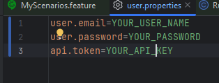

# Test Automation Framework (TAF) Template

## Introduction

This repository contains a Java-based Test Automation Framework (TAF) template, focusing on both UI and API testing. It utilizes Cucumber for behavior-driven development (BDD) and includes three basic yet fully functional scenarios. The template serves as a starting point for automation projects, offering a structured foundation with necessary configurations and basic examples.

## Features

- **Cucumber Integration**: Enables writing and executing tests in BDD style.
- **Java 17 Compatibility**: Ensures compatibility with modern Java features.
- **Page Object Model (POM)**: Implements POM for efficient UI test maintenance.
- **API Testing Support**: Setup included for RESTful API testing.
- **Allure Reporting**: Integrated for comprehensive test reporting.
- **Selenide for UI Testing**: Simplifies UI test automation.
- **JUnit 5**: Supports advanced unit testing features.

## Dependencies Overview

- **JUnit 5 (v5.9.2)**
- **Cucumber (v7.2.3)**
- **Allure (v2.17.3)**
- **Selenide (v6.17.2)**
- **Rest-Assured (v5.3.0)**
- **SLF4J and Logback**
- **Jackson, Commons-DBUtils, Awaitility, AssertJ, Lombok**

## Prerequisites

- Java 17
- Maven

## Setup and Installation

1. Clone the Repository: `git clone [repository-url]`
2. Navigate to the project directory: `cd taf-template-empty`
3. Install Dependencies: `mvn clean install`

## Writing Tests

### Structure

- **Feature Files**: `src/test/resources/features`
- **Step Definitions**: `src/main/java/org/example/steps`
- **Page Objects**: `src/main/java/org/example/fe`

### Creating a New Test

1. Define a scenario in a feature file.
2. Create step definitions in Java.
3. Run tests using Maven or an IDE.

## Running Tests

- Run `mvn test` to execute all tests.
- Run `mvn test site` to get Allure report.
- Results and logs are in the `target` directory.
- Use your own test properties

## Reporting

- Generate Allure reports using `mvn allure:serve`.

## Jenkins Pipeline

[Pipeline](pipeline.groovy)

This pipeline script is designed for automating processes in the context of Continuous Integration (CI) and Continuous Deployment (CD), written in a language used by systems like Jenkins. Here's a breakdown of each stage and a general explanation of the syntax:
- agent any: Specifies that the job can run on any available agent. An agent is a server or virtual machine where the job is executed.
- parameters: This section defines parameters that can be modified when the pipeline is triggered. In this case, there is one parameter, TAF_BRANCH, which refers to the branch of the repository to be used for testing. The default is set to the master branch.
- options: This section contains various settings for the pipeline. timestamps() adds time stamps to each log line, which is useful for tracking the duration of operations.
- stages: Defines the sequence of stages to be executed.
  - stage('Checkout from GitHub'): This stage involves checking out code from a Git repository.
    - cleanWs() cleans the workspace before starting a new task.
    - echo prints a message.
    - git clones the repository specified in url, using the branch defined in TAF_BRANCH.
  - stage('Run Maven Tests'): This stage runs Maven tests.
    - withCredentials is used for securing credentials. Variables for email, password, and API token are defined here.
    - sh executes a shell command to run Maven with the specified parameters and credentials.
  - stage('Generate Allure Report'): The final stage generates an Allure report.
    - allure command generates testing reports based on the results found in target/allure-results.

This pipeline is designed to automate the software testing process, from retrieving source code from a repository to running tests and generating test reports.
